# Chelsea Pride Website

Welcome to Chelsea Pride, the definitive online destination for fans of Chelsea Football Club. This website offers a dynamic platform for accessing the latest club news, player updates, and historical insights. It's designed to foster a sense of community among fans, enabling easy engagement through interactive features and social media integration.

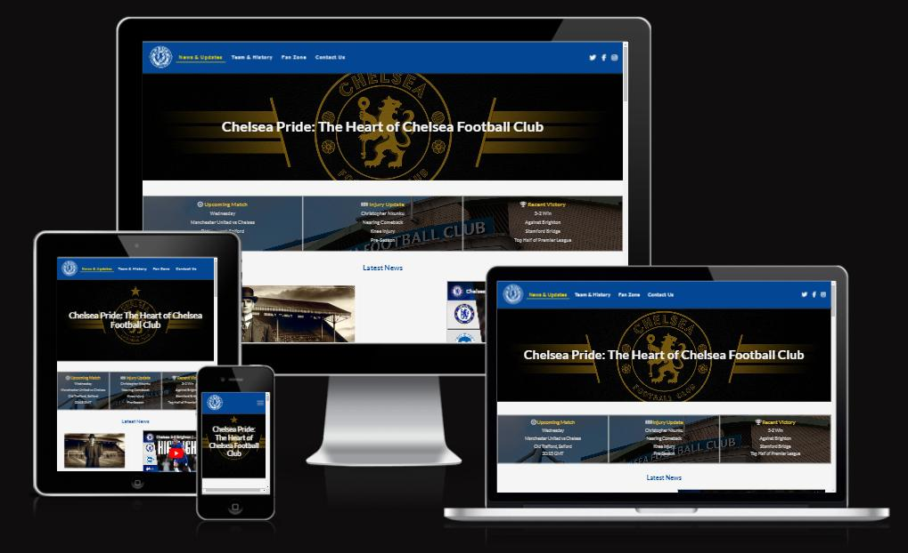

## Table of Contents

- [Chelsea Pride Website](#chelsea-pride-website)
  - [Table of Contents](#table-of-contents)
  - [UX](#ux)
    - [User Goals](#user-goals)
    - [User Stories](#user-stories)
    - [Site Owner's Goals](#site-owners-goals)
- [Design Choices](#design-choices)
  - [Fonts](#fonts)
  - [Icons](#icons)
  - [Colors](#colors)
  - [Structure](#structure)
  - [Wireframes](#wireframes)
    - [Desktop Wireframe](#desktop-wireframe)
    - [Tablet Wireframe](#tablet-wireframe)
    - [Phone Wireframe](#phone-wireframe)
- [Features](#features)
  - [Features](#features-1)
    - [Planned Features for Chelsea Pride](#planned-features-for-chelsea-pride)
    - [Existing Features](#existing-features)
      - [Desktop (\>=992px)](#desktop-992px)
      - [Small devices (\<768px)](#small-devices-768px)
    - [Footer](#footer)
  - [Technologies Used](#technologies-used)
  - [Languages](#languages)
  - [Libraries \& Frameworks](#libraries--frameworks)
  - [Tools](#tools)
- [Testing](#testing)
  - [HTML](#html)
  - [CSS](#css)
  - [Accessbility](#accessbility)
  - [Encountered Issues and Resolutions](#encountered-issues-and-resolutions)
- [Deployment](#deployment)
- [Credits](#credits)
  - [Code Inspiration, Help, and Advice](#code-inspiration-help-and-advice)
  - [Design and Content Inspiration](#design-and-content-inspiration)
  - [Images and Media](#images-and-media)

<small><i><a href='http://ecotrust-canada.github.io/markdown-toc/'>Table of contents generated with markdown-toc</a></i></small>

[Back to Top](#table-of-contents)

## UX

### User Goals

- Stay updated with Chelsea FC news and match results.
- Engage in fan discussions and community activities.
- Explore Chelsea FC's history and legacy.

### User Stories

- **As a user**, I want to access current match results and analysis to keep up with the team's performance.
- **As a user**, I seek detailed information about the club's history to deepen my connection with Chelsea FC.
- **As a fan**, I desire to participate in discussions and polls, sharing my passion with fellow supporters.

### Site Owner's Goals

- Offer comprehensive Chelsea FC information, encompassing news and history.
- Foster a platform for fan connection and shared enthusiasm.
- Ensure an intuitive and accessible website for diverse fan demographics.

[Back to Top](#table-of-contents)

# Design Choices

## Fonts

- **Main Text: Lato** - A clear, modern sans-serif font used for readability in main content.
- **Headers/Navigation: Raleway** - Stylish, noticeable font enhancing headers and navigation elements.

## Icons

- Icons from [Font Awesome](https://fontawesome.com/ "Font Awesome") enhance user interaction, used for social media links, contact options, and mobile navigation.

## Colors

The color palette for Chelsea Pride has been carefully selected to align with Chelsea FC's branding and to ensure optimal contrast and visual appeal. The colors were chosen using [Colors.co](https://colors.co/ "Colors"), a tool that helps generate harmonious color schemes.

- **Chelsea Blue (#034694)**: Primary color for headers and key elements, reflecting Chelsea FC's brand.
- **Slate Grey (#C0C0C0)**: Secondary elements like borders and buttons.
- **Off-White (#F5F5F5)**: Background color, ensuring readability.
- **Dark Grey (#383838)**: Main text color, offering a softer alternative to black.
- **Metallic Gold (#D4AF37)**: Accent color for highlighting critical elements.

## Structure

The Chelsea Pride website was developed with a mobile-first approach, ensuring optimal performance and design for smaller screens before adapting to larger ones. This method aligns with modern web design standards for a seamless user experience across various devices.

## Wireframes

Wireframes for Chelsea Pride were created using Balsamiq, focusing initially on mobile layout before scaling up to tablet and desktop versions. These wireframes guided the design process, ensuring a user-friendly and effective layout. They are available for review in the project repository.

Below are the wireframes for "Chelsea Pride" across different devices:

### [Desktop Wireframe](docs/wireframe-Desktop.png "Desktop wireframe")

### [Tablet Wireframe](docs/wireframe-Tablet.png "Tablet wireframe")

### [Phone Wireframe](docs/wireframe-Mobile.png "Phone wireframe")

[Back to Top](#table-of-contents)

# Features

## Features

### Planned Features for Chelsea Pride

- **Responsive Navbar**: Easy navigation across different sections.
- **News & Updates Section**: Regular updates on Chelsea FC.
- **Team & History Section**: Showcasing player profiles and club history.
- **Fan Zone**: Interactive area for fan engagement.
- **Contact Us Section**: Easy communication with the site administrators.
- **Dynamic Content Display**: Multimedia elements for a visually engaging experience.
- **Interactive Elements**: Polls, quizzes, and news items for enhanced interaction.
- **Accessibility Features**: Design focusing on inclusivity for all users.
- **Footer Section**: Additional navigation links and essential information.

### Existing Features

- **Navigation Bar**: Fully responsive with essential links for easy navigation.

#### Desktop (>=992px)

  
- A distinct visual change in text color upon clicking provides feedback to the user, confirming their selection.

#### Small devices (<768px)

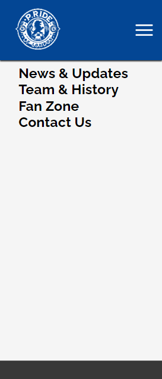

- On smaller screens, the navigation bar adapts to a hamburger menu style to ensure usability is maintained. This compact form factor preserves screen real estate while still providing easy access to all navigation links.
  
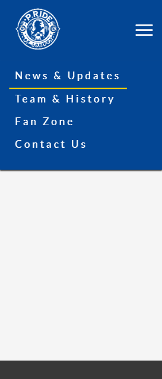
  
- Tapping the hamburger icon reveals the full menu, presenting the same essential navigation links as on larger screens but in a vertical layout, optimized for touch interaction.

[Back to Top](#table-of-contents)

- **Main Banner with Site Title**: Visually striking design introducing the site.

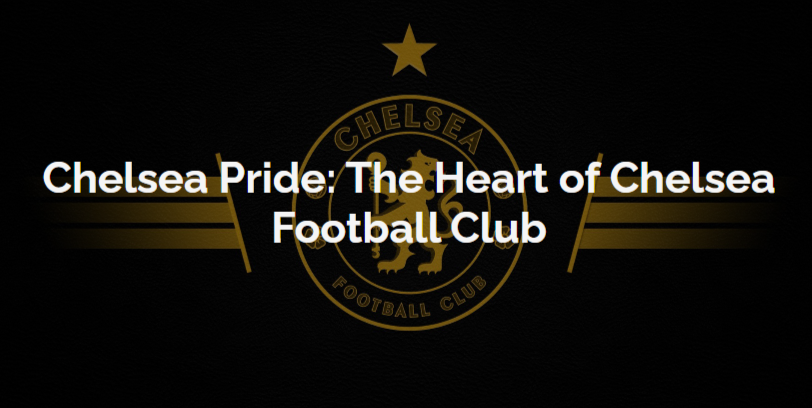

[Back to Top](#table-of-contents)

- **Featured Content Section**: Highlighting latest news and features.

[Back to Top](#table-of-contents)

- **Latest News Section**: Hub for current happenings in Chelsea FC.
  
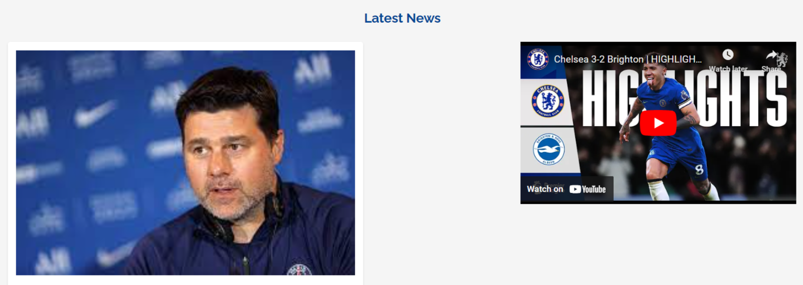

[Back to Top](#table-of-contents)

- **Club Timeline**: Chronological journey through significant club milestones.

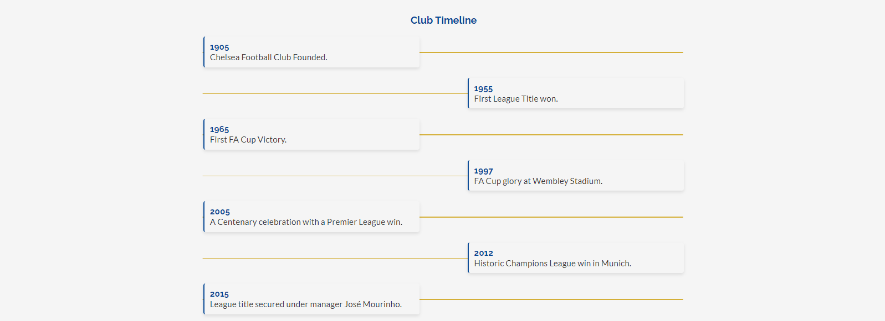

[Back to Top](#table-of-contents)

- **Legendary Figures**: Profiles of iconic contributors to Chelsea FC's history.

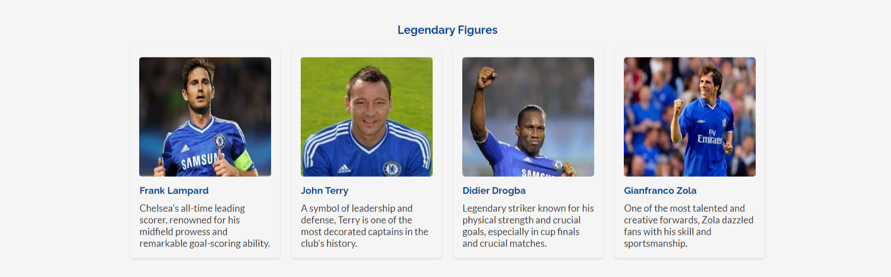

[Back to Top](#table-of-contents)

- **Memorable Matches**: Recalling significant matches in the club's history.
  
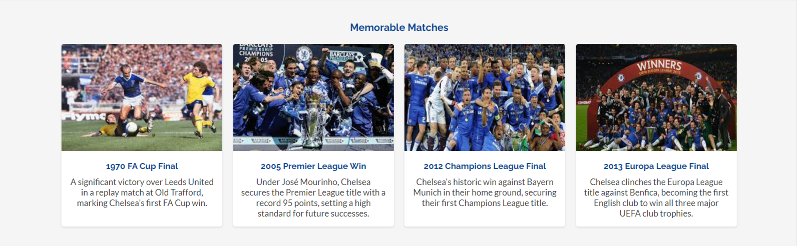

[Back to Top](#table-of-contents)
  
- **Fan Zone**: Engaging fans with polls, discussions, and more.

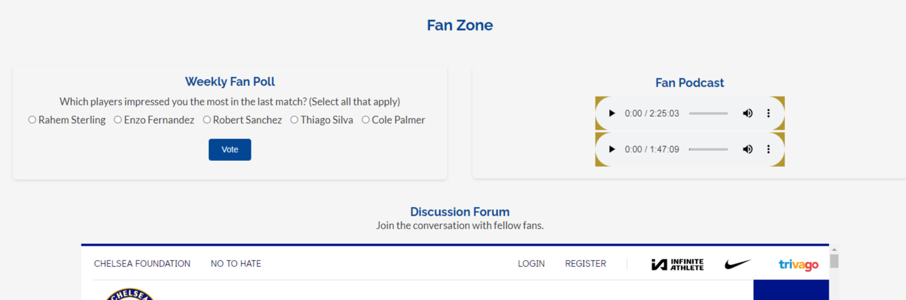

[Back to Top](#table-of-contents)

- **Contact Us**: Direct communication channel with the club.

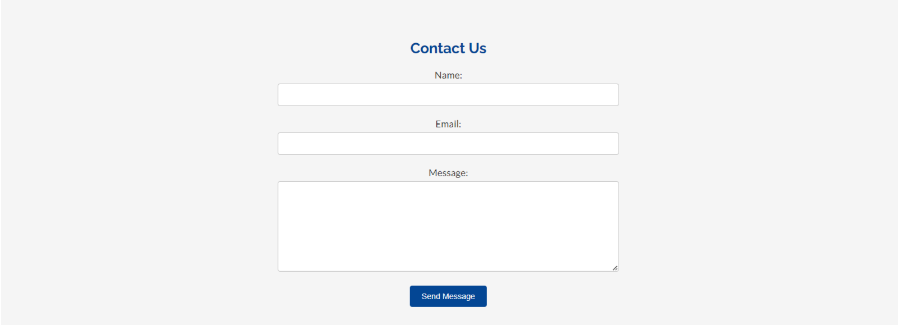

[Back to Top](#table-of-contents)

### Footer

[Back to Top](#table-of-contents)

## Technologies Used

## Languages

- [HTML](https://en.wikipedia.org/wiki/HTML "HTML") - For structuring web content.

- [CSS](https://en.wikipedia.org/wiki/CSS "CSS") - For styling HTML content.

## Libraries & Frameworks

- [Google Fonts](https://fonts.google.com/ "Google Fonts") - For diverse font styles.

- [Font Awesome](https://fontawesome.com/ "Font Awesome") - For a wide range of icons.

## Tools

- [Codeanywhere](https://codeanywhere.com/ "Codeanywhere") - Cloud IDE used for website development.
- [Balsamiq](https://balsamiq.com/wireframes/ "Balsamiq") - For wireframing during the design phase.
- [W3C HTML Validation Service](https://validator.w3.org/ "W3C HTML") - For validating HTML content.
- [W3C CSS Validation Service](https://jigsaw.w3.org/css-validator/ "W3C CSS") - For validating CSS styles.
- [Box Shadow Generator](https://html-css-js.com/css/generator/box-shadow/ "html-css-js.com") - For creating CSS box shadows.
- [Colors.co](https://colors.co/ "Colors") - For generating harmonious color schemes.

[Back to Top](#table-of-contents)

# Testing

The Chelsea Pride website was rigorously tested to ensure it meets its goals and provides an optimal user experience. Designed responsively, it adapts seamlessly across various devices, ensuring clear and sharp display of content. The site is user-friendly, enabling easy navigation and communication through forms and social media links, while maintaining simplicity and conciseness in content.

## HTML

- No errors were returned when passing through the officail W3C validator.

## CSS

- No errors were returned when passing through the officail (Jigsaw) validator.

## Accessbility

- I confirmed that the colors and the fonts chosen are easy o read and accessible by running ti through the Lighthouse in DevTools.

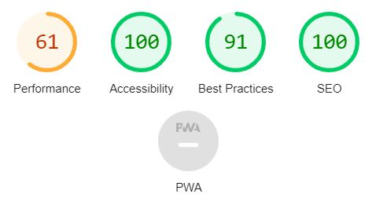

## Encountered Issues and Resolutions

- **Responsive Design Adjustments**: Enhanced for larger screens with added breakpoints.
- **Wireframe Design Modifications**: Revised for improved user experience and visual appeal.
- **Forum Link Positioning**: Adjusted in CSS for correct desktop placement.
- **HTML Validation Issues**: Corrected obsolete attributes and text placement in iframes.
- **CSS Frameborder Obsolescence**: Replaced with CSS for border styling.
- **Unresponsive 'a' Link**: Fixed in the 'fan-forum' section for full functionality.

These resolutions significantly improved the website's functionality, usability, and aesthetic appeal.

[Back to Top](#table-of-contents)

# Deployment

Deploying the Chelsea Pride website involved the following steps on GitHub Pages:

1. Navigate to the GitHub repository and click **Settings**.
2. Select **Pages** in the side navigation menu.
3. Under **Source**, choose the **main** branch.
4. Click **Save** to deploy the website.

The live site is accessible at [https://yosephdev.github.io/Chelsea-Pride](https://yosephdev.github.io/Chelsea-Pride), automatically reflecting any committed updates.

[Back to Top](#table-of-contents)

# Credits

Acknowledgements for the Chelsea Pride website:

## Code Inspiration, Help, and Advice

- [Simen Daehlin](https://github.com/Eventyret) for guidance and project ideas.
- [CSS-Tricks](https://css-tricks.com/) for CSS tips.
- [Code Institute](https://www.codeinstitute.net/) for HTML and CSS support.

## Design and Content Inspiration

- [Chelsea FC Official Website](https://www.chelseafc.com/) for club details.
- [The Pride of London](https://theprideoflondon.com/) for layout concepts.

## Images and Media

- [Unsplash](https://unsplash.com/) for high-quality, free images.
- [FontAwesome](https://fontawesome.com/) for website icons.

[Back to Top](#table-of-contents)
