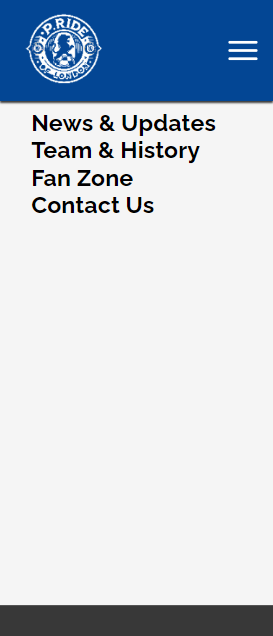
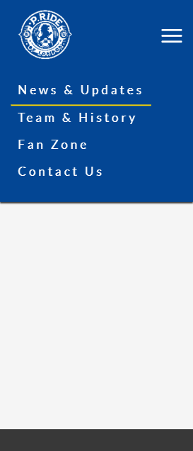

# Chelsea Pride

# Goal for this Project

Welcome to Chelsea Pride, a vibrant hub for Chelsea Football Club enthusiasts. This website is a dedicated space for fans of all ages, offering the latest in club news, player insights, and historical retrospectives.

This site facilitates easy interaction with the club and fellow fans through social media and a direct contact form, making it simple and accessible for everyone to stay connected with the Chelsea community.

# Table of Contents

- [Chelsea Pride](#chelsea-pride)
- [Goal for this Project](#goal-for-this-project)
- [Table of Contents](#table-of-contents)
- [UX](#ux)
- [User Goals](#user-goals)
- [User Stories](#user-stories)
- [Site Owner's Goals](#site-owners-goals)
- [Requirements](#requirements)
- [Expectations](#expectations)
- [Design Choices](#design-choices)
  - [Fonts](#fonts)
  - [Icons](#icons)
  - [Colors](#colors)
- [Structure](#structure)
  - [Mobile-First Design](#mobile-first-design)
  - [Responsive Breakpoints](#responsive-breakpoints)
- [Wireframes](#wireframes)
    - [Desktop Wireframe](#desktop-wireframe)
    - [Tablet Wireframe](#tablet-wireframe)
    - [Phone Wireframe](#phone-wireframe)
- [Features](#features)
- [Planned Features for Chelsea Pride](#planned-features-for-chelsea-pride)
  - [Proposed Features](#proposed-features)
  - [Existing Features](#existing-features)
    - [Navigation Bar](#navigation-bar)
      - [Desktop (\>=992px)](#desktop-992px)
      - [Small devices (\<992px)](#small-devices-992px)
      - [Enhancements and Responsive Behavior](#enhancements-and-responsive-behavior)

# UX

# User Goals

- Access the latest Chelsea FC news, match results, and player updates.
- Engage with other Chelsea supporters and participate in fan discussions.
- Learn about Chelsea FC's history and legendary players.

# User Stories

- I want up-to-date match results and analyses to follow the team's performance.  
- I need to learn about the club's history to feel more connected.  
- I wish to engage in discussions and polls with fellow fans.

# Site Owner's Goals

- Provide all-inclusive information on Chelsea FC, from news to history.  
- Create a space for fans to connect and share their passion.
- Maintain an intuitive, accessible website for all fans.

# Requirements

- Regularly update the site with the latest Chelsea FC news and match info.
- Include interactive elements like forums and polls.
- Feature a section dedicated to the club's rich history.

# Expectations

- Users expect an interactive experience with fresh, engaging content.
- The site should be a trusted source for accurate Chelsea FC information.
- Ensure the website is user-friendly and accessible across devices.

\
&nbsp;
[Back to Top](#table-of-contents)
\
&nbsp;

# Design Choices

## Fonts

For "Chelsea Pride," I have chosen distinct and complementary fonts from Google Fonts to enhance the website's readability and aesthetic appeal.

- **Main Text: Lato** - [Lato](https://fonts.google.com/ "Google Fonts") is a sans-serif font known for its clarity and modern feel. It provides a clean, approachable look, making it perfect for the main content, where legibility is key.

- **Headers and Navigation Bar: Raleway** - To create a clear distinction between the main text and headers, I've selected [Raleway](https://fonts.google.com/ "Google Fonts"). This font, with its elegant and slightly more stylized characters, complements Lato while ensuring that headers and navigation elements are noticeable and appealing.

## Icons

The website will incorporate icons from the [Font Awesome library](https://fontawesome.com/ "Font Awesome") Font Awesome library. These icons will be used intuitively, ensuring they are self-explanatory. Key areas for their use include social media links, contact links, and a hamburger menu icon for navigation on mobile devices. All icons will be styled to align with the overall design of the website.

## Colors

For the color scheme, I've used [Colors.co](https://colors.co/ "Colors") to generate a palette that resonates with Chelsea FC's identity while ensuring good contrast and visual appeal.

- ##034694 - This colour will be used in headers and key interface elements.

- ##C0C0C0 - This color will be used for secondary elements like borders, buttons, and icon backgrounds to provide a modern, sophisticated look.

- ##F5F5F5 - This color will be used for the website's background, ensuring that the content stands out without causing strain to the eyes.

- ##383838 - This color will be use for the main text, providing excellent readability against the off-white background while softening the contrast compared to pure black.

- ##D4AF37 - This color will be used for highlighting important elements such as active menu items or call-to-action buttons, adding a touch of elegance and importance.

# Structure

The website will be developed with a 'mobile-first' approach, prioritizing optimization for smaller screens before scaling up to larger devices. This approach aligns with modern web design practices, ensuring a seamless user experience across all devices.

## Mobile-First Design

- **Base Size**: The development will start with styling for the iPhone 5/SE, which represents one of the smallest screen sizes (320px) commonly in use. This ensures that the design remains functional and visually appealing on smaller screens.

## Responsive Breakpoints

Responsive breakpoints will be defined based on the updated [Bootstrap](https://getbootstrap.com/docs/5.0/layout/breakpoints/) Bootstrap breakpoints, which are widely recognized and align with contemporary device standards. These breakpoints allow the layout to adapt dynamically to different screen sizes, ensuring optimal readability and usability.

| Screen Size | Breakpoint |
|-------------|------------|
| x-small     | <576px     |
| small       | ≥576px     |
| medium      | ≥768px     |
| large       | ≥992px     |
| x-large     | ≥1200px    |
| xx-large    | ≥1400px    |

\
&nbsp;
[Back to Top](#table-of-contents)
\
&nbsp;

# Wireframes

For "Chelsea Pride," I utilized Balsamiq to create the wireframes. The process began with designing the mobile version, ensuring that the layout and content are optimized for smaller screens. Following the mobile-first approach, the design was then scaled up to accommodate tablet and desktop views.

Given the goal to provide concise yet impactful information to the user, the website is structured as a single-page layout. This design choice facilitates a smooth user journey, allowing visitors to seamlessly scroll through content and easily reach the contact form and club details. The navigation bar also provides direct access to different sections for enhanced user experience.

Below are the wireframes for "Chelsea Pride" across different devices:

### [Desktop Wireframe](wireframes/Wireframe-Desktop.png "Desktop wireframe")

### [Tablet Wireframe](wireframes/Wireframe-Tablet.png "Tablet wireframe")

### [Phone Wireframe](wireframes/Wireframe-phnne.png "Phone wireframe")

\
&nbsp;
[Back to Top](#table-of-contents)
\
&nbsp;

# Features

# Planned Features for Chelsea Pride

The following features are proposed for development in the Chelsea Pride website. Each feature will be implemented systematically, with commits corresponding to the completion of each task.

## Proposed Features

1. **Responsive Navbar**: Design and implement a navigation bar with links to different sections (News & Updates, Team & History, Fan Zone, Contact Us), enabling smooth scrolling and easy navigation within the single-page layout.

2. **News & Updates Section**: Create a section for regularly updated content providing the latest Chelsea FC news, match updates, and club announcements.

3. **Team & History Section**: Develop a section showcasing the Chelsea team and club history, including player profiles and historical achievements.

4. **Fan Zone**: Implement an interactive area for fan engagement, featuring discussions, polls, and user-generated content.

5. **Contact Us Section**: Include a contact form and social media links for easy communication with the site administrators or the club.

6. **Mobile-First Design**: Ensure the website is optimized for mobile devices, providing a seamless experience on smartphones and tablets.

7. **Dynamic Content Display**: Integrate multimedia elements like images, videos, and live social media feeds for a visually engaging user experience.

8. **Interactive Elements**: Add polls, quizzes, and clickable news items to enhance user interaction and engagement.

9. **Accessibility Features**: Design the website with accessibility in mind, using high-contrast colors and readable fonts to cater to all users.

10. **Footer Section**: Design a footer containing additional navigation links, copyright information, and other essential details.

Each feature will be developed in stages, with regular commits to track progress and ensure quality.

## Existing Features

### Navigation Bar

The navigation bar has been thoughtfully designed to be fully responsive, accommodating various screen sizes with ease. It includes essential links for easy navigation throughout the site and prominently features the Chelsea Pride logo, which also serves as a clickable link to return to the homepage.

#### Desktop (>=992px)

- The navigation bar spans the full width of the screen on desktop devices, making all links (News & Updates, Team & History, Fan Zone, Contact Us) clearly visible and accessible. This arrangement ensures straightforward and intuitive navigation for end users.
- Hover effects have been incorporated to visually indicate which link the user is hovering over, highlighted by a change in text color and an underline effect.
  

  
- A distinct visual change in text color upon clicking provides feedback to the user, confirming their selection.

#### Small devices (<992px)

- On smaller screens, the navigation bar adapts to a hamburger menu style to ensure usability is maintained. This compact form factor preserves screen real estate while still providing easy access to all navigation links.
  

  
- Tapping the hamburger icon reveals the full menu, presenting the same essential navigation links as on larger screens but in a vertical layout, optimized for touch interaction.

#### Enhancements and Responsive Behavior

- **Responsive Design**: The navigation bar's responsiveness is meticulously crafted, providing a seamless transition between different device sizes.
- **Font Awesome Icons**: The integration of Font Awesome icons, specifically for social media links, augments the navigation bar's functionality and aesthetic appeal.
- **Hover and Focus Effects**: Enhanced hover and focus effects on the desktop version improve the user's interactive experience, making navigation intuitive and visually engaging.
- **Font Size Adjustments**: Targeted font size adjustments for medium screens (between 768px and 991px) enhance readability and ensure a balanced appearance across devices.
- **Layout Optimization**: The stacking issue of menu items on tablet and desktop views has been resolved, ensuring a horizontal and evenly spaced layout.

The revamped navigation bar significantly elevates the usability and visual appeal of the Chelsea Pride website, aligning with contemporary web design standards and ensuring an engaging user experience across all devices.

\
&nbsp;
[Back to Top](#table-of-contents)
\
&nbsp;
