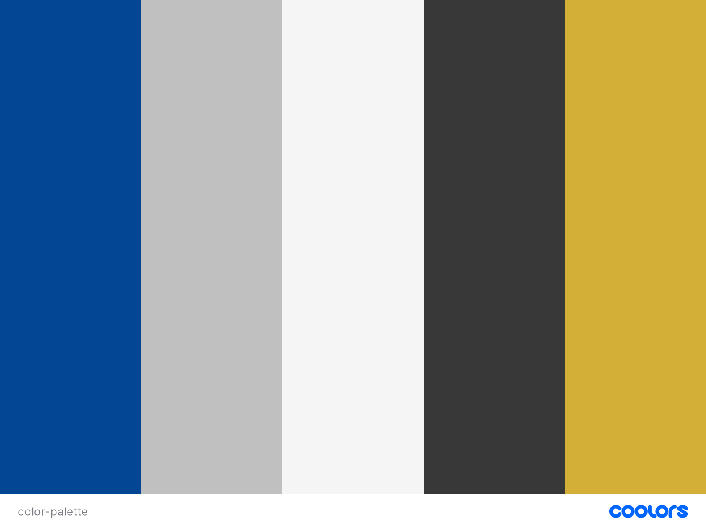

# Chelsea Pride

# Goal for this Project

Welcome to Chelsea Pride, a vibrant hub for Chelsea Football Club enthusiasts. This website is a dedicated space for fans of all ages, offering the latest in club news, player insights, and historical retrospectives.

This site facilitates easy interaction with the club and fellow fans through social media and a direct contact form, making it simple and accessible for everyone to stay connected with the Chelsea community.

# Table of Contents

- [Chelsea Pride](#chelsea-pride)
- [Goal for this Project](#goal-for-this-project)
- [Table of Contents](#table-of-contents)
- [UX](#ux)
- [User Goals](#user-goals)
- [User Stories](#user-stories)
- [Site Owner's Goals](#site-owners-goals)
- [Requirements](#requirements)
- [Expectations](#expectations)
- [Design Choices](#design-choices)
  - [Fonts](#fonts)
  - [Icons](#icons)
  - [Colors](#colors)
- [Structure](#structure)
  - [Mobile-First Design](#mobile-first-design)
  - [Responsive Breakpoints](#responsive-breakpoints)

# UX

# User Goals

- Access the latest Chelsea FC news, match results, and player updates.
- Engage with other Chelsea supporters and participate in fan discussions.
- Learn about Chelsea FC's history and legendary players.

# User Stories

- I want up-to-date match results and analyses to follow the team's performance.  
- I need to learn about the club's history to feel more connected.  
- I wish to engage in discussions and polls with fellow fans.

# Site Owner's Goals

- Provide all-inclusive information on Chelsea FC, from news to history.  
- Create a space for fans to connect and share their passion.
- Maintain an intuitive, accessible website for all fans.

# Requirements

- Regularly update the site with the latest Chelsea FC news and match info.
- Include interactive elements like forums and polls.
- Feature a section dedicated to the club's rich history.

# Expectations

- Users expect an interactive experience with fresh, engaging content.
- The site should be a trusted source for accurate Chelsea FC information.
- Ensure the website is user-friendly and accessible across devices.

# Design Choices

## Fonts

For "Chelsea Pride," I have chosen distinct and complementary fonts from Google Fonts to enhance the website's readability and aesthetic appeal.

- **Main Text: Lato** - [Lato](https://fonts.google.com/ "Google Fonts") is a sans-serif font known for its clarity and modern feel. It provides a clean, approachable look, making it perfect for the main content, where legibility is key.

- **Headers and Navigation Bar: Raleway** - To create a clear distinction between the main text and headers, I've selected [Raleway](https://fonts.google.com/ "Google Fonts"). This font, with its elegant and slightly more stylized characters, complements Lato while ensuring that headers and navigation elements are noticeable and appealing.

## Icons

The website will incorporate icons from the [Font Awesome library](https://fontawesome.com/ "Font Awesome") Font Awesome library. These icons will be used intuitively, ensuring they are self-explanatory. Key areas for their use include social media links, contact links, and a hamburger menu icon for navigation on mobile devices. All icons will be styled to align with the overall design of the website.

## Colors

For the color scheme, I've used [Colors.co](https://colors.co/ "Colors") to generate a palette that resonates with Chelsea FC's identity while ensuring good contrast and visual appeal.

- #034694 - This colour will be used in headers and key interface elements.

- ##C0C0C0 - This color will be used for secondary elements like borders, buttons, and icon backgrounds to provide a modern, sophisticated look.

- ##F5F5F5 - This color will be used for the website's background, ensuring that the content stands out without causing strain to the eyes.

- ##383838 - This color will be use for the main text, providing excellent readability against the off-white background while softening the contrast compared to pure black.

- ##D4AF37 - This color will be used for highlighting important elements such as active menu items or call-to-action buttons, adding a touch of elegance and importance.

# Structure

The website will be developed with a 'mobile-first' approach, prioritizing optimization for smaller screens before scaling up to larger devices. This approach aligns with modern web design practices, ensuring a seamless user experience across all devices.

## Mobile-First Design

- **Base Size**: The development will start with styling for the iPhone 5/SE, which represents one of the smallest screen sizes (320px) commonly in use. This ensures that the design remains functional and visually appealing on smaller screens.

## Responsive Breakpoints

Responsive breakpoints will be defined based on the updated [Bootstrap](https://getbootstrap.com/docs/5.0/layout/breakpoints/) Bootstrap breakpoints, which are widely recognized and align with contemporary device standards. These breakpoints allow the layout to adapt dynamically to different screen sizes, ensuring optimal readability and usability.

| Screen Size | Breakpoint |
|-------------|------------|
| x-small     | <576px     |
| small       | ≥576px     |
| medium      | ≥768px     |
| large       | ≥992px     |
| x-large     | ≥1200px    |
| xx-large    | ≥1400px    |
